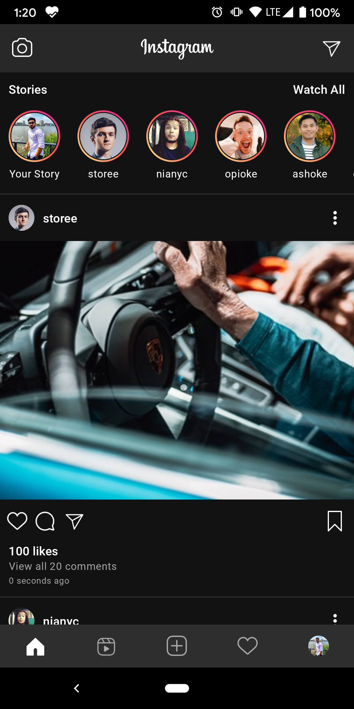

# PuppySocial

PuppySocial is a text-based social media app built with [Jetpack Compose][compose].

This sample showcases:

* Home Screen with Text Posts
* Post Like Button Animation
* Text Post Display
* Social Media Feed Interface

<p float="center">
  
  
  
</p>

PuppySocial is a text-focused social media platform where users can share thoughts, updates, and engage with posts through likes and comments.

Libraries:
* Compose Toolkit
* [Coil][coil]
* Kotlin Coroutines

[compose]: https://developer.android.com/jetpack/compose
[coil]: https://coil-kt.github.io/coil/compose


## License

```
Copyright 2020 Vipul Asri

Licensed under the Apache License, Version 2.0 (the "License");
you may not use this file except in compliance with the License.
You may obtain a copy of the License at

    https://www.apache.org/licenses/LICENSE-2.0

Unless required by applicable law or agreed to in writing, software
distributed under the License is distributed on an "AS IS" BASIS,
WITHOUT WARRANTIES OR CONDITIONS OF ANY KIND, either express or implied.
See the License for the specific language governing permissions and
limitations under the License.
```

